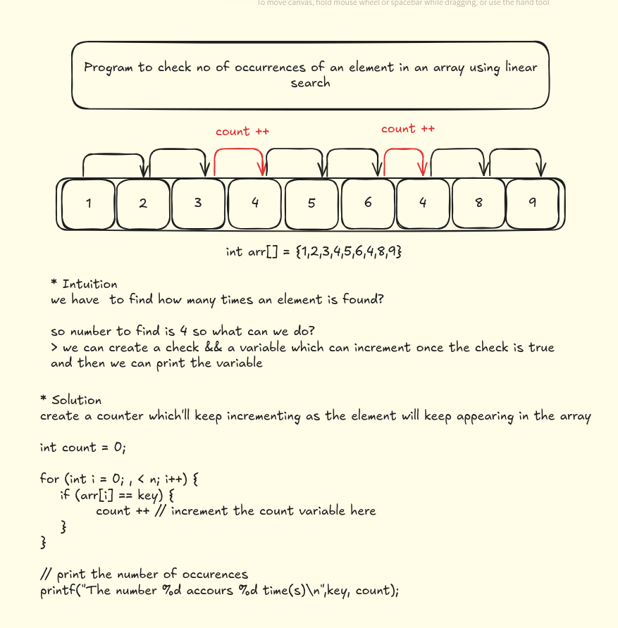
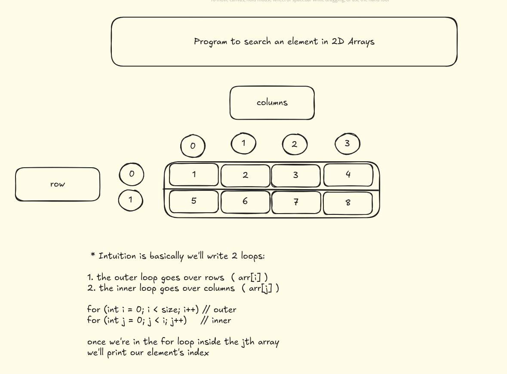
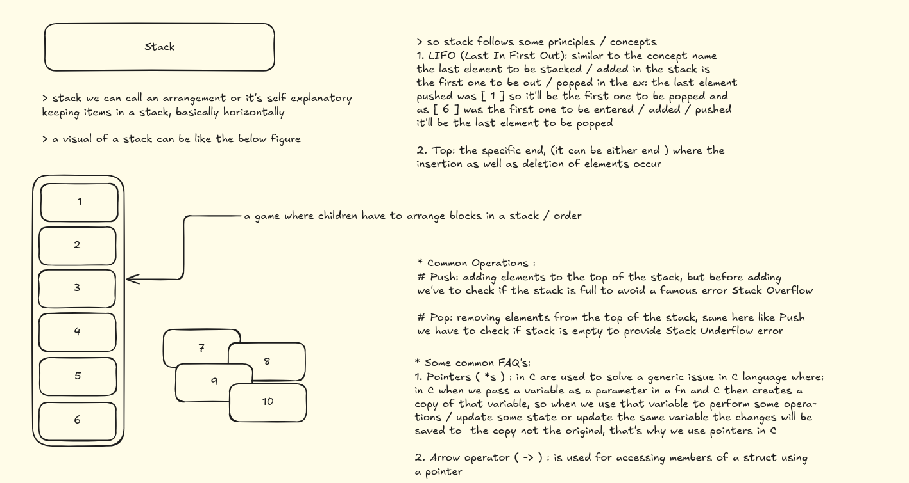

# Arrays - Data Structures and Algorithms

This directory contains various array implementations and algorithms in C programming language.

## 📚 Concepts Covered

### 1. Linear Search
Basic searching algorithm that checks each element sequentially until the target is found.

**Files:** `01-linear-search.c`

### 2. Element Comparison
Finding elements greater than a specific value in an array.

**Files:** `02-find-greater-number-than-element.c`

### 3. Counting Occurrences
Algorithm to count how many times a specific element appears in an array.

**Key Concept:** Use a counter variable that increments each time the target element is found.

**Files:** `03-count-occurences.c`

**Algorithm Steps:**
1. Initialize counter to 0
2. Loop through each array element
3. If element matches target, increment counter
4. Return final count

### 4. 2D Array Search
Searching elements in a two-dimensional array using nested loops.

**Files:** `04-linear-search-2d.c`

**Key Concepts:**
- **Outer loop:** Iterates through rows (`arr[i]`)
- **Inner loop:** Iterates through columns (`arr[i][j]`)
- **Indexing:** `arr[row][column]` to access specific elements

**Algorithm Pattern:**
\`\`\`c
for (int i = 0; i < rows; i++) {        // Outer loop for rows
    for (int j = 0; j < columns; j++) { // Inner loop for columns
        // Access element at arr[i][j]
    }
}
\`\`\`

### 5. Stack Implementation (Array-Based)
A stack data structure implemented using arrays, following the LIFO (Last In First Out) principle.

**Files:** `05-stack.c`

**Key Concepts:**
- **LIFO Principle:** Last element added is the first one to be removed
- **Top Pointer:** Keeps track of the index of the top element
- **Array-Based:** Uses a fixed-size array to store stack elements

**Core Operations:**
1. **Push:** Add element to the top of the stack
2. **Pop:** Remove and return the top element
3. **isEmpty:** Check if stack has no elements
4. **isFull:** Check if stack has reached maximum capacity

**Stack Structure:**
\`\`\`c
#define MAX_SIZE 10

struct Stack {
    int items[MAX_SIZE];  // Array to store elements
    int top;              // Index of top element (-1 for empty)
};
\`\`\`

**Important Notes:**
- **Pointers (`*s`):** Used to modify the original stack, not a copy
- **Arrow Operator (`->`):** Shorthand for accessing struct members through pointers
  - `s->top` is equivalent to `(*s).top`
- **Stack Overflow:** Occurs when trying to push to a full stack
- **Stack Underflow:** Occurs when trying to pop from an empty stack

## 🔧 Compilation Instructions

To compile any of the C files:

\`\`\`bash
gcc filename.c -o output_name
./output_name
\`\`\`

Example:
\`\`\`bash
gcc 01-linear-search.c -o linear_search
./linear_search

gcc 05-stack.c -o stack
./stack
\`\`\`

## 📖 Learning Notes

### Array Fundamentals
- Arrays store elements of the same data type in contiguous memory locations
- Zero-based indexing: first element is at index 0
- Fixed size determined at declaration time

### Stack Fundamentals
- Built on top of arrays using a `top` index pointer
- Provides controlled access (only top element accessible)
- Essential for function calls, expression evaluation, and backtracking algorithms

### Time Complexity
- **Linear Search:** O(n) - worst case checks every element
- **2D Array Search:** O(m×n) - where m is rows and n is columns
- **Counting Occurrences:** O(n) - single pass through array
- **Stack Operations:** O(1) - push, pop, isEmpty, isFull all constant time

### Space Complexity
- **Array algorithms:** O(1) additional space (constant space)
- **Stack:** O(n) space where n is the maximum stack size

## 🚀 Next Steps
After mastering arrays and stacks, proceed to:
- Linked Lists
- Queues
- Trees and Graphs
