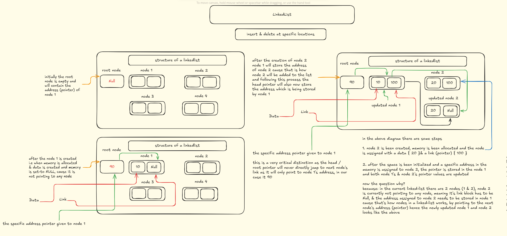
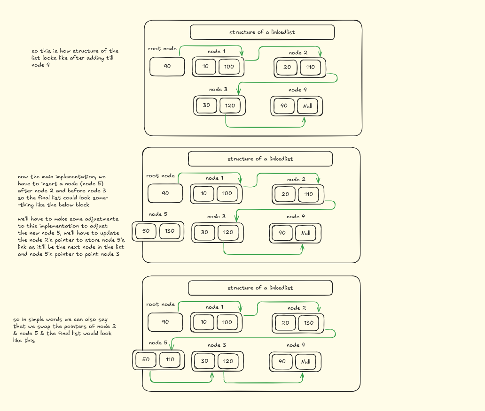
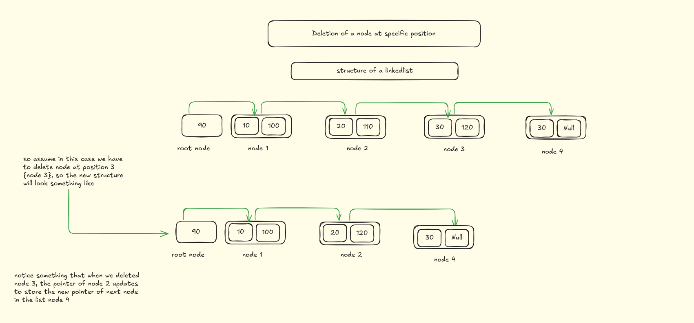

# Linked List Operations – Insert & Delete at Specific Position

This folder demonstrates **linked list operations** with clear **diagrammatic explanations** for:
- **Inserting a node at a specific position**
- **Deleting a node at a specific position**

---

## 📌 1. Insertion at a Specific Position

In a singly linked list, inserting at a specific position involves:
1. Traversing the list until the node just before the desired position.
2. Updating the **previous node’s pointer** to point to the **new node**.
3. Making the **new node’s pointer** point to the next node in the list.

✅ This ensures the new node is added in the correct order without breaking the chain.

### Example
Insert **Node 5** between **Node 2** and **Node 3**:
- Update Node 2’s pointer → Node 5
- Node 5’s pointer → Node 3

### Final structure:
```
Root → Node 1 → Node 2 → Node 5 → Node 3 → Node 4 → NULL
```

### Diagram
  


---

## 📌 2. Deletion at a Specific Position

Deleting a node at a given position requires:
1. Traversing to the node **just before** the one to be deleted.
2. Updating its pointer to skip the unwanted node and point directly to the next node.
3. Freeing memory (if implemented in C/C++).

✅ This ensures the chain remains intact and the unwanted node is removed safely.

### Example
Delete **Node 3**:
- Node 2’s pointer, instead of pointing to Node 3, is updated to point to Node 4.

### Final structure:
```
Root → Node 1 → Node 2 → Node 4 → NULL
```

### Diagram


---

## 📌 Summary
- **Insertion** → Adjust pointers to “insert” a new node at the desired spot.
- **Deletion** → Adjust pointers to “skip” the node to be deleted.

Both operations are pointer manipulations that keep the linked list intact.

---

✨ These diagrams are a great visual guide to understanding how linked list pointers update during **insertions** and **deletions** at specific positions.  