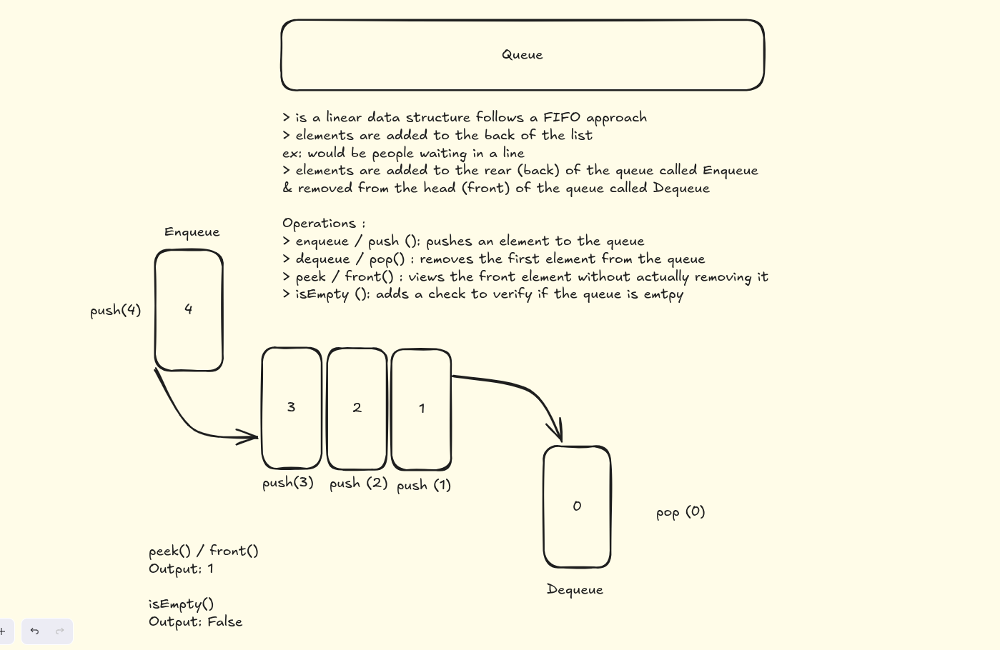

# Queue Implementation in C (Using Arrays)

## 📌 Introduction
This project demonstrates the implementation of a **Queue** in C using arrays.  
A Queue is a **linear data structure** that follows the **FIFO (First In, First Out)** principle:
- Elements are **added** to the **rear** of the queue (**Enqueue** operation).
- Elements are **removed** from the **front** of the queue (**Dequeue** operation).

---

## ⚙️ Operations Implemented
- **enqueue(value) / push(value):** Insert an element into the queue.
- **dequeue() / pop():** Remove an element from the queue.
- **peek() / front():** View the element at the front of the queue without removing it.
- **isEmpty():** Check whether the queue is empty.
- **isFull():** Check whether the queue is full.

---

## 🖼️ Visualization
The following diagram illustrates the working of a queue:



---

## 🚀 Example
```c
enqueue(10);   // Queue: 10
enqueue(20);   // Queue: 10, 20
enqueue(30);   // Queue: 10, 20, 30
dequeue();     // Removes 10 → Queue: 20, 30
peek();        // Output: 20
